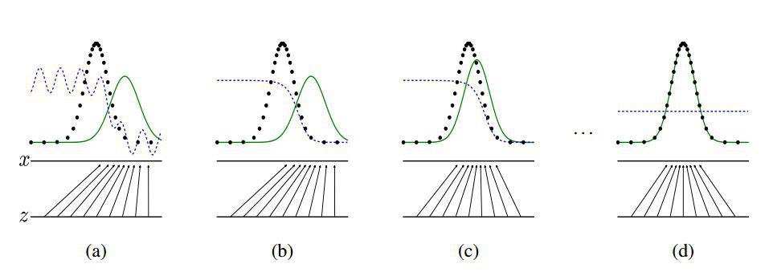
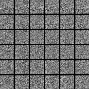

# Generative Adversarial Nets

GANs in TensorFlow <br>
This repo attempts to reporduce the amazing work GANs([Goodfellow I J, Pougetabadie J, Mirza M, et al. Generative Adversarial Nets[J]. Advances in Neural Information Processing Systems, 2014, 3:2672-2680.](https://arxiv.org/pdf/1406.2661.pdf))



## How to

setup TensorFlow 1.0 environment, and run the following command.

### MNIST

```sh
python main.py --dataset=MNIST [--use_gpu=1]
```

### CIFAR

```sh
python main.py --dataset=CIFAR
```

## Results

### MNIST

<br>
Iteration 0 to 10000

## To do

- [x] MNIST dataset experiment    
- [ ] cifar-10 dataset experiment
